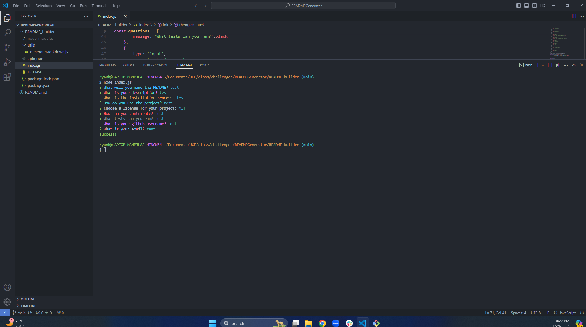
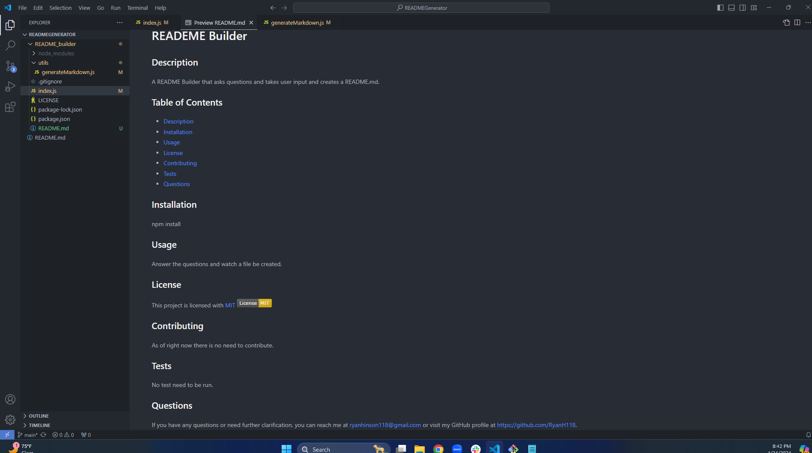
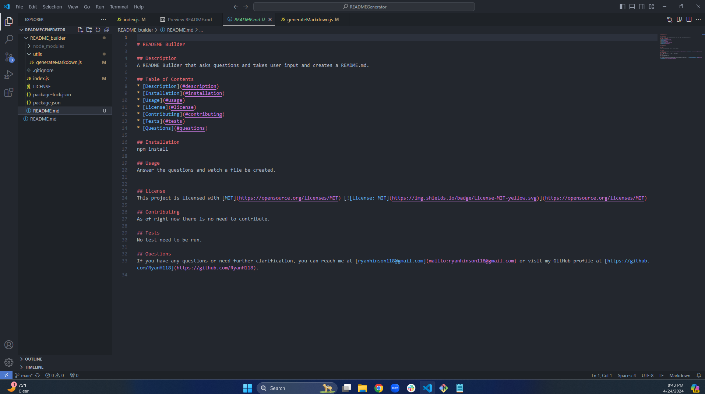

# README Builder
        
## Description

I was motivated in this challenge to create a README Builder that creates a README.md for future projects. The goal I wanted to complete is to use inquirer to ask me a series of questions and I input my answers. Then when I am done with the questions I get a "success!" message and a README.md file is created with my answers. I learned how to use node.js, inquirer and even colors. When using node.js I learned how to create a package with npm init and how to install other modules like inquirer and colors. By using inquirer I learned how to get my terminal to ask me question and I can give it answers to then make a file. I learned how to get my questions text to have a color.

## Website Link

https://watch.screencastify.com/v/MjlGxSQZccbuF7de7fyL
          
## Installation
npm install
          
## Usage
Answer the questions and watch a file be created.
  

## License
This project is licensed with [MIT](https://opensource.org/licenses/MIT) 
          
## Questions
If you have any questions or need further clarification, you can reach me at [ryanhinson118@gmail.com](mailto:ryanhinson118@gmail.com) or visit my GitHub profile at [https://github.com/RyanH118](https://github.com/RyanH118).
 